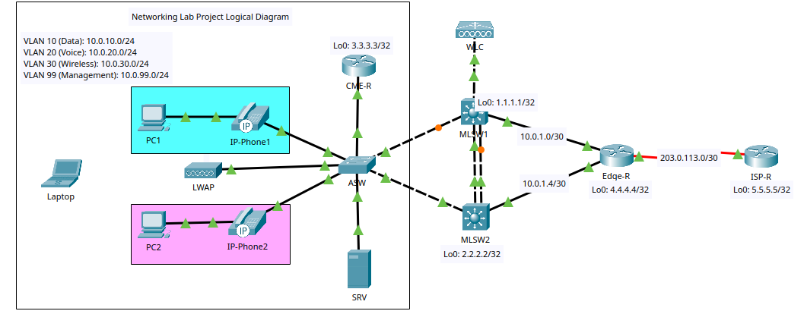

# My Networking Lab Project

Welcome to my personal Networking Lab Project! Inspired by Daniel Lepiscopo's excellent repo, I'm building this to prepare for the Cisco CCNA 200-301 certification. I'll be using Cisco Packet Tracer (PT) to simulate an enterprise-like network environment. The goal is to implement and document key networking concepts hands-on, starting from the basics and progressing step by step. Each goal will have its own detailed lab documentation, configurations, and explanations. I'll push updates to my GitHub repo after completing each section to track progress and ensure everything works before moving on.

I want a slightly more campus-oriented topology than the linear one in the Daniel Lepiscopo's repo, including a Wireless LAN Controller (WLC) for proper wireless management. I'll explain every step clearly, including why certain configurations are used, potential pitfalls, and verification commands.

## Project Structure
To keep things organized, here's the planned GitHub repo structure:
```
networking-lab-project/
├── README.md               # This file: Project overview, goals, skills, topology
├── topology/               # Diagrams and notes
│   ├── physical-topology.png  # diagram of physical connections in PT
│   ├── logical-topology.png   # logical overview (subnets, VLANs)
│   └── topology-notes.md      # Additional notes on design choices
├── configs/                # Device running configs (saved from PT after each lab)
│   ├── routers/            # Routers configurations
│	│	├──
│	│	├──
│	│	└──
│   ├── switches/           # Switches configurations
│	│	├──
│	│	├──
│	│	└──
│   └── wireless/			# Wireless configurations
│       └──      
├── labs/                   # Detailed Markdown docs for each goal
│   ├── goal1_design_and_setup.md
│   ├── goal2_subnetting_and_ip.md
│   ├── goal3_vlans_and_trunks.md
│   └── goal4_stp_rstp.md
│   ... # More goals will be added once completed
└── pkt-files/              # Packet Tracer .pkt files saved after each goal
    └── networking-lab-project.pkt
```

I'll add screenshots in the labs where helpful for visualization. All configs will be copied from PT's CLI.

## Goals
We'll tackle these one by one, documenting and testing each before pushing to GitHub:
1. Design topology and basic setup.
2. Subnetting and IP configuration.
3. VLANs and trunks.
4. STP/RSTP.
5. Inter-VLAN routing.
6. Static and default routing.
7. Dynamic routing (OSPF/EIGRP/RIP).
8. DHCP and DNS.
9. Wireless basics.
10. ACLs.
11. NAT/PAT.
12. HSRP/VRRP/GLBP.
13. SNMP/NTP/syslog.
14. IPv6 basics.
15. QoS fundamentals.
16. Device discovery (CDP/LLDP).
17. Basic security (port security, DHCP snooping, ARP inspection, remote SSH).
18. Troubleshooting tips.

## Skills Demonstrated
This project showcases a wide range of networking skills through practical implementation:
- **DHCP Configuration**: Setting up DHCP servers, multiple pools, excluded addresses, default routers, DNS servers in pools, Option 150 for voice pools, Option 43 for WiFi and management pools.
- **Basic Device Hardening**: Service password-encryption, enable secret, hostname configuration, clock timezone, username with privilege 15, IP SSH version 2, IP SCP server enable, no IP domain-lookup, IP domain-name.
- **Spanning Tree**: Spanning-tree mode PVST/Rapid-PVST, spanning-tree portfast, spanning-tree bpduguard enable, spanning-tree VLAN priority.
- **Routing**: Loopback interfaces for OSPF router ID, subinterfaces with 802.1Q encapsulation, OSPF process/router-ID/passive-interface/network statements, static/default routing, IP routing.
- **Access Control and Management**: Access-list 99 for management, VTY access-class, login local on lines, transport input SSH, exec-timeout on lines, logging synchronous, MOTD banner.
- **Monitoring and Logging**: SNMP community RO, logging trap debugging, syslog server, NTP authentication-key/trusted-key/server/master/update-calendar.
- **Switching and Trunking**: Port-channel configuration, switchport trunk native VLAN/allowed VLANs/mode trunk/nonegotiate, access VLAN/voice VLAN configuration, EtherChannel with LACP (mode active) or static (mode on).
- **Security Features**: Switchport port-security/mac-address sticky/maximum/violation restrict, DHCP snooping/trust on trunks/limit rate, IP ARP inspection/trust on trunks/validate src-mac dst-mac ip.
- **Redundancy**: HSRP version 2/virtual IP/priority/preempt, standby timers.
- **Voice and Telephony**: Telephony-service, max-ephones/max-dn, IP source-address for CME, auto assign ephones, ephone-dn configurations/numbers, IP helper-address on SVIs.
- **QoS**: QoS class-map/policy-map, priority percent for voice, bandwidth percent for vlan10, fair-queue for default class, MLS QoS.
- **Discovery and Misc**: LLDP run, no CDP run, interface descriptions, access ports shutdown where unused, port-security sticky MAC addresses configured/specific MACs.
- **Wireless and Other**: SVI interfaces for VLANs, SNMP community different strings.

These will be integrated across the goals where relevant.

### Devices (All Available in Packet Tracer)
- **MLSW1 & MLSW2**: Multilayer switches (e.g., 3560) for inter-VLAN routing via SVIs, HSRP, STP, OSPF.
- **ASW**: Access switch (e.g., 2960) for host connections, port security, VLANs.
- **WLC**: Wireless LAN Controller (e.g., 3504) for managing wireless.
- **LWAP**: Light Weight Access Point (e.g., LAP-PT) connected to ASW.
- **CME-R**: Router (e.g., 2811) for Cisco Unified Communications Manager Express (CME/voice), subinterfaces on trunk, DHCP.
- **Edge-R**: Router (e.g., 2911) for NAT/PAT, dynamic routing with MLSWs and CME-R.
- **ISP-R**: Simple router (e.g., 1941) simulating the internet.
- **Hosts**: 
  - PC1/PC2 (Data VLAN).
  - IP-Phone1/IP-Phone2 (Voice VLAN, connected to ASW with PC1/PC2 behind it for voice/data).
  - Laptop (Wireless).
  - Server (For DNS/syslog).

### Logical Topology 


- Connections:
  - ASW trunks to MLSW1 and MLSW2 (e.g., EtherChannel for load-balancing/STP).
  - CME-R trunks to ASW (for subinterfaces demonstrating router-on-a-stick).
  - WLC to MLSW1 (management interface).
  - AP to ASW (PoE port if possible in PT).
  - Edge-R to MLSW1/MLSW2 (for redundancy).
  - Edge-R serial to ISP-R (serial connections).